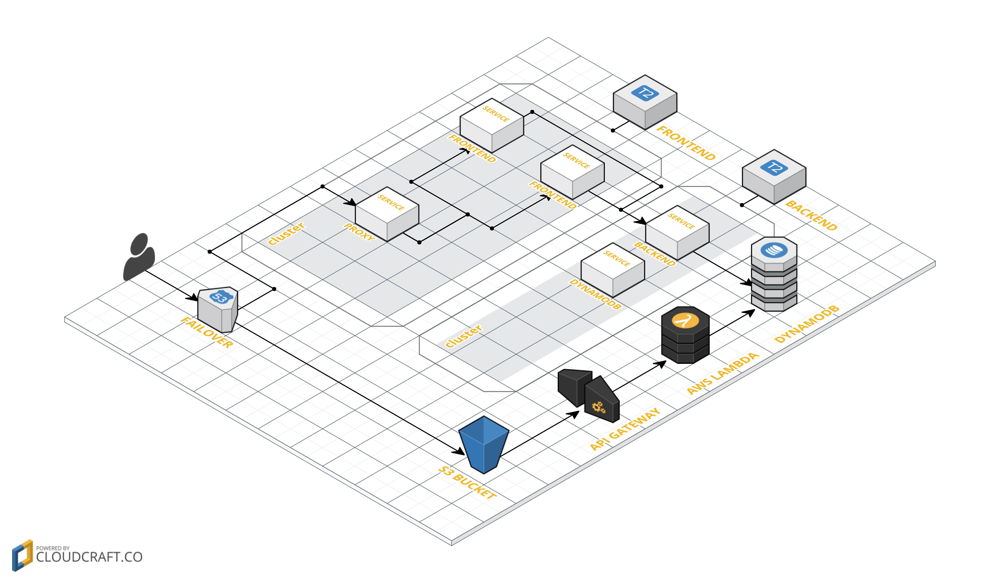

# Zender-live-battles
## Table of Contents
- [Infrastructure](#staging-infrastructure-on-aws)
- [Structure](#repo-structure)
- [Makefile](#makefile-usage)
    - [Github](#github)
    - [Deployment](#deployment)
    - [Docker](#docker)
    - [Local Environment](#local-development-environment)
    - [AWS](#aws)
    - [Battles](#battles)

## Staging infrastructure on AWS

## Repo structure
1. `./dynamo`
  	- directory voor het opzetten van een lokale docker omgeving
  	- code: `docker-compose up`
  	- tags: `docker`, `redis`, `dynamodb`
2. `./backend`
  	- directory met alle backend code voor de battles.tv api
  	- code: `npm i && node/nodemon ./src/server.js`
  	- tags: `koajs`, `nodejs`
3. `./frontend`
  	- directory met alle frontend code voor battles.tv 
  	- code: `npm i && npm start`
	- tags: `reactjs`, `create-react-app`, `skeleton`
4. `./failover`
	- directory met failover docker
5. `./nginx`
	- directory met nginx proxy / loadbalancing docker
6. `./slack`
	- directory met alles omtrent de Slack AWS Lambda function voor ECS state change notifications

## Makefile usage
### Github
- `make pull`
	- pull alle code van de development branch
- `make push MESSAGE="foo"` 
	- pusht alle lokale code naar de development branch
- `make staging`
    - pusht alle code van development branch naar staging branch
    - start build op CircleCI
    - CircleCI pusht naar staging ECR
- `make production`
	- pusht alle code van de staging branch naar de production branch
	- start build op CircleCI
    - na succesvolle build push naar production ECR (zender.tv)

### Deployment
- `make deploy-staging`
    - doet een aws s3 sync naar de staging s3 bucket met de correcte build
    - API Gateway
- `make deploy-production`
    - doet een aws s3 sync naar de production s3 bucket met de correcte build
    - api.zender.tv
- `make frontend-update`
    - voert een rolling update uit op de staging environment van de frontend containers

### Docker
- `make docker-rm`
 	- verwijdert alle 'exited' docker containers
- `make docker-rmi`
	- verwijdert alle 'unused' docker images

### Local development environment
- `make start-%`
	- zet een omgeving op voor `frontend`, `backend` of `dynamo`	
	- volgorde `dynamo` -> `backend` -> `frontend`
- `make test`
	- voert de testen uit op backend
	- maakt de tabellen aan op de dynamo container

### AWS
- `make update`
    - update de gecachte bestanden volgens de ingestelde cluster
- `make set-cluster-%`
    - stelt de huidige cluster in en doet een update van de gecachte data
- `make instance-describe-%`
	- returned ofdat de instance running of stopped is met wat extra informatie
- `make instance-start-%`
- `make instance-stop-%`
- `make service-describe-%`
	- geeft algemene informatie weer over de service (zoals task definition en hoeveel tasks er runnen)
- `make service-delete-%`
    - zet de desired count op 0 en verwijdert de service
- `make service-enable-%`
    - zet de desired count op 1
- `make service-disable-%`
    - zet de desired count op 0
- `make logs-%`
	- toont de laatste logs van de gekozen service
- `make ssh-%`
	- geeft de mogelijkheid om aan de hand van het instance-id te ssh'en naar de ec2 instance
- `make task-stop-%`
    - stopt een specifieke task
- `make task-describe-%`
    - toont algemene informatie van een specifieke task

### Battles
- `make battle-local`
    - voert een curl uit met data gevonden in `./assets/battles/` naar localhost
- `make battle-staging`
    - naar staging backend container
