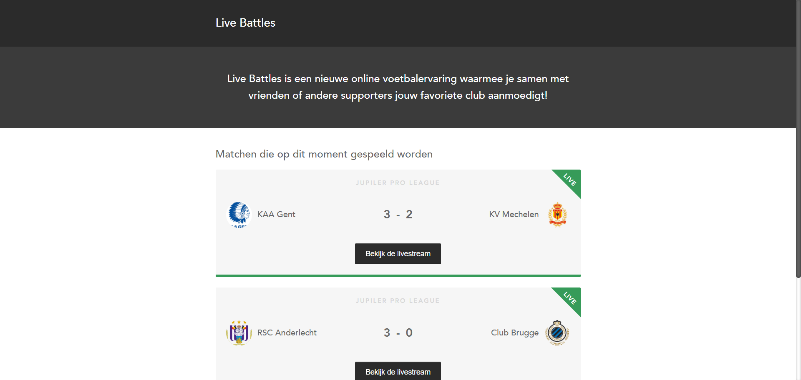
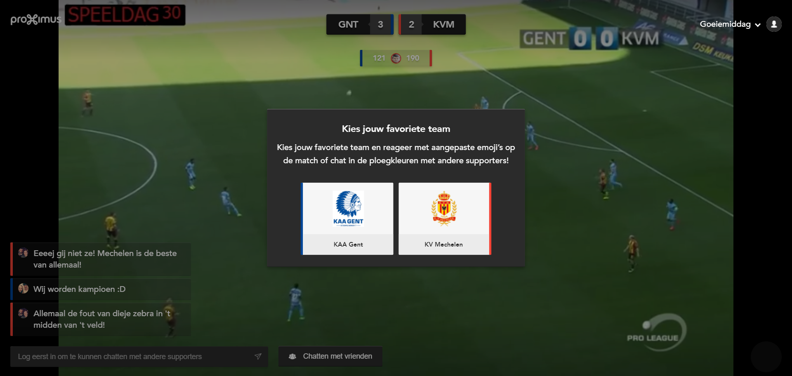
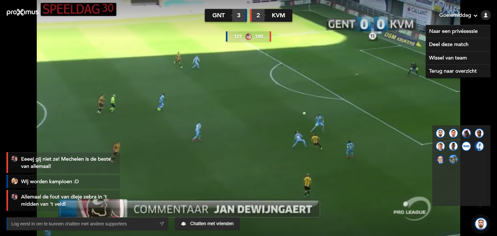
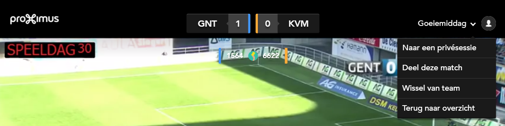
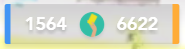
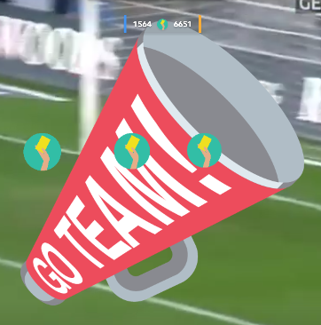
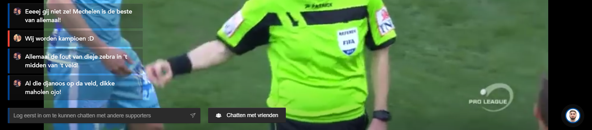
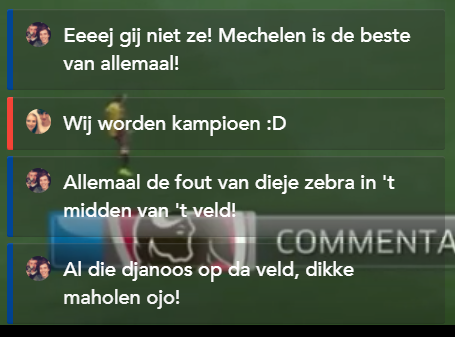
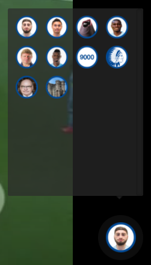
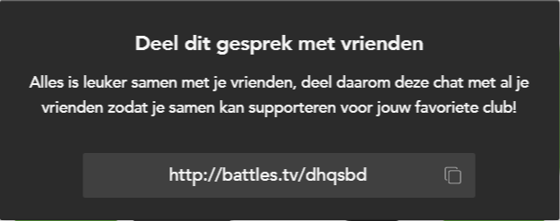

# Zender-live-battles - Frontend

## Table of Contents
* [Intro](#intro)
* [Stack](#stack)
* [Structure](#structure)

## Intro

This is the frontend for the Battles.tv project. Every available battle is listed in the overview.

## Stack

This application was build using:

* Components:
	* [Reactjs](https://facebook.github.io/react/) setup with [create-react-app](https://github.com/facebookincubator/create-react-app)
	* [React-router v3](https://github.com/ReactTraining/react-router)
	* [Connect](http://redux.js.org/docs/basics/UsageWithReact.html)

* State managment:
	* [Redux](http://redux.js.org/)
	* [Redux Saga](https://redux-saga.js.org/)
	* [Pusher](https://pusher.com/)

* Styling:
	* [Sass](http://sass-lang.com/)

* Development:
	* [Redux devtool](https://chrome.google.com/webstore/detail/redux-devtools/lmhkpmbekcpmknklioeibfkpmmfibljd?hl=en)
	* [Reactjs devtool](https://chrome.google.com/webstore/detail/react-developer-tools/fmkadmapgofadopljbjfkapdkoienihi?hl=en)

## Structure

The structure of the application is:

* [Overview](#overview): Home page with an overview containing all battles.
* [Battle](#battle): Detail page/livestream of a battle.
* [Common](#common): Common component (e.g. Spinner, NotFound, ...).

### Overview

The battles overview is built with the following components:

* [Header](#header)
* [Banner](#banner)
* [BattleList](#battlelist)
	* [BattleItem](#battleitem)

#### Header

Contains the site title with the option to show authentication info. The authentication info (disabled in current version of Battles.tv) consists of user information and a login/logout button.

#### Banner

The banner can be used to show brief information concerning the current battles.

#### BattleList

Renders an overview of all battles based on a given list (of battles). A BattleList contains 0 or more BattleItems.

#### BattleItem

Visualizes a single battle in a clean card format. A BattleItem is a child element of a BattleList.

---

### Battle

All components in a battle detail page can be seperated into following categories based on position:

* Root: [Battle](#battle)

* Top:
	* [Header](#header)
	* [Counters](#counters)

* Middle:
	* [Sticker](#sticker)
	* [Media](#media)
	* [EmojiHitArea](#emojihitarea)

* Bottom:
	* [Footer](#footer)
		* [ChatList](#chatlist)
			* [ChatItem](#chatitem)
		* [ChatInput](#chatinput)
		* [CurrentEmoji](#currentemoji)		
		* [EmojiList](#emojilist)
			* [EmojiItem](#emojiitem)

* Overlay:
	* [ChoiceModal](#choicemodal)
	* [ShareModal](#sharemodal)

#### Battle

This root component contains all sub components for a battle detail page. Whenever a user joins a battle, this component will load the Zender stream and get all battle information from the api. If this component is unmounted, the current user will automatically leave the battle.

---

#### Header

Positioned at the top of the screen, this component contains the current score from the game (hard coded in the battle) along with the `battleOptions` dropdown. In this dropdown, the user get a couple of actions, concerning the current battle, that can be triggered.

#### Counters

This component displays the number of emojis triggered by each of the teams. These numbers are obtained by adding up the individual counters of every emoji in the team emoji set.

In between the counters, the most used emoji (across the two teams) is shown.

---

#### Sticker

This sticker will show based on the number of emojis triggered by a team. This number can be set with the `stickerThreshold` in the sticker saga. By default, this threshold is set to 25.

#### Media

This component visualizes the media triggered by Zender. Based on the content-type, an image of video will be rendered. For video playback, [JwPlayer](https://www.jwplayer.com/) was implemented.

#### EmojiHitArea

This clickable canvas element overlays the entire media component. Whenever a user clicks on the canvas, an emoji (based on the [CurrentEmoji](#currentemoji) is drawn on the position of the click. If two emojis of the same team collide, a small explosion is shown.

Simultaneously, the canvas watches the Zender store for emojis triggered by other users. Emojis triggered by other users will be drawn on canvas based on the origin (team) of the emoji.

The actual rendering, animations and collisions are all handled by the `EmojiCanvas` class.

---

#### Footer

Positioned at the bottom, the `Footer` component contains the `ChatInput`, `CurrentEmoji`, `EmojiList` and a button for joining a private session (or share the session if the user is in a private session).

#### ChatList

A list component that renders the shouts found in the Zender store. By default the entire list of shouts is passed down to this component. This shoutlist is filtered based on the list of active users in the current session (only shouts of users in the session will be shown).

Every shout in this component is rendered with via [ChatItem](#chatitem)

#### ChatItem

Child component of the [Chatlist](#chatlist) that renders one single shout.

#### ChatInput

Input giving the user the option to express their feelings or leave a comment about the stream in the chat. Every message will appear in the [Chatlist](#chatlist) after submission.

In order to chat, the user has to be logged in, which will happen automatically if the user clicks the ChatInput (and isn't yet logged in).

> **NOTE**: Zender has a profanity filter that will make sure that inappropriate language can't be posted.

#### CurrentEmoji

This component displays the selected emoji by the user. Whenever a user clicks on the [EmojiHitArea](#emojihitarea), this emoji will be thrown on the stream.

By default, the currentEmoji is set to the first emoji in the set.

#### EmojiList

Visualizes a Zender emojiSet by rendering an [EmojiItem](#emojiitem) for every emoji in the set. This component can be accessed by clicking the [CurrentEmoji](#currentemoji).

The set of emojis visualized by this component, depends on the team the current user pick on the [ChoiceModal](#choicemodal).

#### EmojiItem

Child component of the [EmojiList](#emojilist) that renders one single emoji. Clicking on this component will change the [CurrentEmoji](#currentemoji) to the selected emoji.

---

#### ChoiceModal

Gives the user the option pick a team when joining a battle.

**Example:**

#### ShareModal

Shows a short url of the current battle. This url can be copy-pasted to share with friends.

**Example:**

---

### Common

Following are supporting components for the application:

* [NoMatch](#nomatch)
* [Spinner](#spinner)

#### NoMatch

Redirects user to homepage (battles overview) when attempting to access a non-existing route.

#### Spinner

Shows a spinner/loading icon whenever a page is not (yet) fully loaded.
