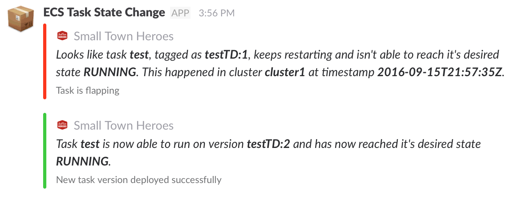

# Pushing ECS Task state changes to Slack

## Description
An [AWS Lambda](https://aws.amazon.com/lambda/) Function that posts notifications to [Slack](https://slack.com/) when changes occur. It checks if a task has been stuck trying to reach it's desired state (running). The function will only post to Slack in the following cases:
- When a task is stuck and can't reach running state at 5 failed attempts
- When a task finally breaks out of his restart loop and manages to run on it's own
- When a new version of a failing task (with over 5 failed attempts) gets deployed

## Setting up
### DynamoDB
Simply create a table on either a dynamodb-local or [AWS DynamoDB](https://aws.amazon.com/dynamodb) with `id` as it's hash key (S).
You can add an Index for `task` (S) if you would like to expand on this function in the future.

### Serverless deployment to AWS
1. clone this repository.
2. edit `serverless.yml` with your required info (table name, dynamo endpoint and your slack webhook url)
3. run `npm install` to install all required dependencies
4. deploy the serverless function to AWS with `sls deploy`

### Make it listen to ECS
1. go to your AWS console and navigate to [CloudWatch](https://aws.amazon.com/cloudwatch)
2. click on `Rules` 
3. create a new rule
	- Service Name: EC2 Container Service (ECS)
	- Event type: State Change
	- Specific detail type(s): ECS Task State Change
4. add your lambda function that you deployed earlier as a target

## Testing
Simply go into your cluster and try stopping one of your tasks and see if messages are getting sent to slack. Or try running a test directly through AWS Lambda with a preconfigured test event, like [here](./extra/event).

## Logging
When creating a Lambda function CloudWatch logging for that function gets enabled, so if you have trouble setting up, be sure to check the logs if there's anything wrong.

## Issues
If you encounter 'Permission Denied' issues make sure that you give the IAM role, that Serverless assigns to the function, has enough permissions or the correct policies to write to your database.

## Requirements
- [Serverless Framework](https://serverless.com/) 
- [Node Package Manager](https://www.npmjs.com/)
- [Slack Webhook](https://container-ci-workshop.slack.com/apps/new/A0F7XDUAZ-incoming-webhooks)